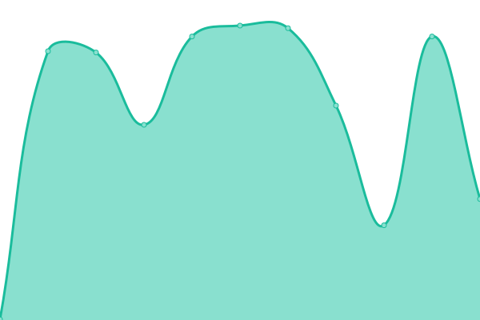

<!--start: status pages-->
<!-- This summary is generated by Upptime (https://github.com/upptime/upptime) -->
<!-- Do not edit this manually, your changes will be overwritten -->
<!-- prettier-ignore -->
| URL | Status | History | Response Time | Uptime |
| --- | ------ | ------- | ------------- | ------ |
|  [Google](https://www.google.com) | 🟩 Up | [google.yml](https://github.com/milobeng/upptime/commits/HEAD/history/google.yml) | 

 75ms
     
 | 

<a href="https://milobeng.github.io/upptime/history/google">100.00%</a>
    

|  [Wikipedia](https://en.wikipedia.org) | 🟩 Up | [wikipedia.yml](https://github.com/milobeng/upptime/commits/HEAD/history/wikipedia.yml) | 

 152ms
     
 | 

<a href="https://milobeng.github.io/upptime/history/wikipedia">100.00%</a>
    

|  [Log](https://log-theta.vercel.app) | 🟩 Up | [log.yml](https://github.com/milobeng/upptime/commits/HEAD/history/log.yml) | 

 702ms
     
 | 

<a href="https://milobeng.github.io/upptime/history/log">100.00%</a>
    

|  [Brawley 2](https://cruelajarevents.teambrawley.repl.co/) | 🟩 Up | [brawley-2.yml](https://github.com/milobeng/upptime/commits/HEAD/history/brawley-2.yml) | 

 931ms
     
 | 

<a href="https://milobeng.github.io/upptime/history/brawley-2">100.00%</a>
    

|  [Ansai](https://ansai.onwebapp.io/) | 🟥 Down | [ansai.yml](https://github.com/milobeng/upptime/commits/HEAD/history/ansai.yml) | 

 1214ms
     
 | 

<a href="https://milobeng.github.io/upptime/history/ansai">100.00%</a>
    

<!--end: status pages-->
